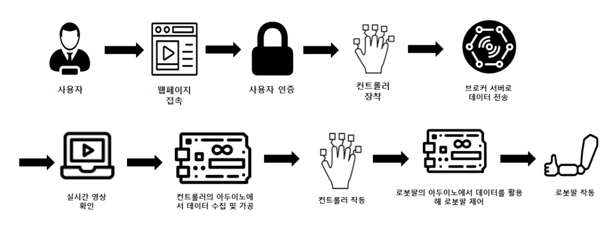
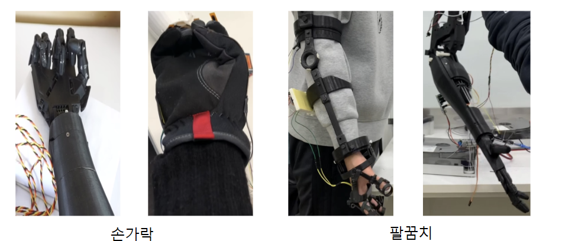
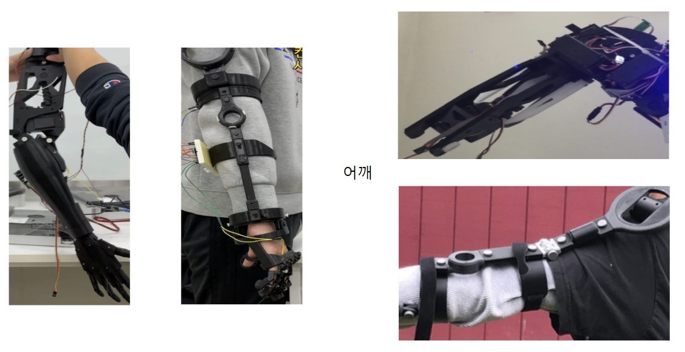

# ROBOBO - AI 제어 로봇 팔 시스템 (AI Controlled Robot Arm System)

ROBOBO는 ICT 멘토링 엑스포 2021 한이음 공모전 출품작(장려상 수상)으로, 인공지능(AI) 및 다양한 센서를 활용하여 사용자의 움직임을 모방하고 자율적으로 동작할 수 있는 로봇 팔 시스템입니다. 이 프로젝트의 목표는 플렉스 센서가 장착된 글러브를 통해 사용자의 손 움직임을 로봇 팔로 실시간 전송하여 정밀하게 모방하고, 웹캠 및 AI 비전 센서를 이용한 제스처/객체 인식 기반의 다중 모드 제어 방식을 구현하는 것이었습니다. 또한, 클라우드 서비스(AWS) 및 웹 애플리케이션(Spring Boot)과의 연동을 통해 데이터 로깅, 사용자 관리, 그리고 향후 원격 제어 및 모니터링 기능 확장의 기반을 마련하고자 했습니다.

<table>
  <tr>
    <td style="text-align: center;">ROBOBO 구성도</td>
    <td></td>
  </tr>
  <tr>
    <td style="text-align: center;">ROBOBO 손</td>
    <td style="text-align: center;">ROBOBO 어깨</td>
  </tr>
  <tr>
    <td></td>
    <td></td>
  </tr>
</table>

## 주요 기능 (Key Features)

*   **실시간 로봇 팔 제어:** 플렉스 센서가 장착된 로봇 글러브를 사용하여 사용자의 손가락 움직임을 로봇 팔이 실시간으로 정밀하게 모방 (BLE 및 WiFi AP 모드 지원).
*   **AI 기반 제스처 인식 제어:** PC 웹캠과 MediaPipe 라이브러리를 활용한 손 제스처(가위, 바위, 보) 인식 후, MQTT 프로토콜을 통해 로봇 글러브/팔에 특정 명령 전달.
*   **AI 비전 센서 연동 자율 동작:** HuskyLens AI 카메라가 특정 객체나 태그를 인식하면, 로봇 팔이 사전 정의된 자율 동작 수행.
*   **다중 통신 프로토콜 통합:** BLE, WiFi (AP/STA 모드), MQTT, TCP/IP 등 다양한 통신 방식을 통합적으로 활용하여 각 기능에 최적화된 데이터 교환 방식 구현.
*   **클라우드 연동 데이터 로깅:** Raspberry Pi를 허브로 사용하여 로봇 글러브의 센서 데이터를 AWS IoT Core로 전송 및 기록.
*   **웹 애플리케이션 기반 관리 시스템:** Spring Boot와 AWS RDS(MySQL)를 이용한 사용자 관리, 데이터 조회 및 잠재적인 로봇 상태 모니터링/제어 웹 인터페이스 제공 (OAuth2 소셜 로그인 지원).
*   **모듈화된 Arduino 펌웨어:** 각 통신 방식(BLE, WiFi) 및 기능(로봇 팔, 로봇 글러브, HuskyLens 연동)에 따른 Arduino 스케치 분리 개발.

## 기술 스택 (Tech Stack)

*   **하드웨어 (Hardware):**
    *   마이크로컨트롤러: Arduino Nano, Arduino Nano 33 IoT, Arduino Nano 33 BLE
    *   싱글 보드 컴퓨터: Raspberry Pi (Model 3B+ or 4 suggested)
    *   센서: Flex Sensors (굴곡 센서), HuskyLens AI Camera
    *   액추에이터: Servo Motors (예: SG90, MG996R)
    *   드라이버: Adafruit PCA9685 16-Channel 12-bit PWM Servo Driver
    *   기타: 웹캠 (PC용)

*   **펌웨어 / 임베디드 (Firmware / Embedded):**
    *   프로그래밍 언어: Arduino C/C++
    *   주요 라이브러리:
        *   `WiFiNINA`: Arduino Nano 33 IoT 등 WiFi 모듈 제어
        *   `Servo`: 서보 모터 제어
        *   `Adafruit_PWMServoDriver`: PCA9685 PWM 드라이버 제어
        *   `ArduinoBLE`: Arduino BLE 기능 제어
        *   `PubSubClient`: MQTT 통신 클라이언트
        *   `HUSKYLENS`: HuskyLens AI 카메라 연동

*   **소프트웨어 (제어, AI, 서버) (Software - Control, AI, Server):**
    *   프로그래밍 언어: Python 3
    *   AI / 컴퓨터 비전: OpenCV, MediaPipe
    *   BLE 통신 (Python on Raspberry Pi): `bluepy`
    *   AWS 연동: `AWSIoTPythonSDK`

*   **통신 프로토콜 (Communication Protocols):**
    *   Bluetooth Low Energy (BLE)
    *   WiFi (IEEE 802.11n, AP & STA modes)
    *   MQTT (Message Queuing Telemetry Transport)
        *   Broker: Mosquitto
    *   TCP/IP
    *   Serial Communication
    *   AWS IoT Core MQTT (over WSS)

*   **백엔드 웹 애플리케이션 (Backend Web Application):**
    *   프레임워크: Spring Boot
    *   프로그래밍 언어: Java (JDK 8 or 11+)
    *   템플릿 엔진: Thymeleaf
    *   보안: Spring Security (OAuth2 for Google/Facebook login, JWT)
    *   ORM: JPA / Hibernate
    *   빌드 도구: Gradle
    *   (보조 MQTT 연동 Spring Boot 애플리케이션도 동일 스택으로 추정)

*   **데이터베이스 (Database):**
    *   MySQL (AWS RDS를 통해 서비스형으로 사용)

*   **클라우드 (Cloud):**
    *   AWS IoT Core: 디바이스 메시징 및 관리
    *   AWS RDS (Relational Database Service): MySQL 데이터베이스 호스팅

## 프로젝트 아키텍처 (Project Architecture)

ROBOBO 시스템은 여러 하드웨어 및 소프트웨어 모듈이 유기적으로 결합된 다층 아키텍처를 가집니다.

*   **임베디드 시스템 (Embedded System Layer):**
    *   **로봇 글러브:** Arduino (Nano 33 BLE/IoT 등) 기반으로, 플렉스 센서로부터 사용자의 손가락 움직임 데이터를 수집합니다. 수집된 데이터는 BLE 또는 WiFi(AP 모드 시 서버 역할, STA 모드 시 MQTT 클라이언트)를 통해 외부로 전송됩니다. MQTT 구독을 통해 PC로부터 제스처 명령을 수신하여 모드를 변경하기도 합니다.
    *   **로봇 팔:** Arduino (Nano 등) 기반으로, 서보 모터들을 제어하여 실제 움직임을 수행합니다. BLE, WiFi (글러브 AP에 대한 클라이언트), 또는 시리얼(HuskyLens)을 통해 명령을 수신합니다. PCA9685 PWM 드라이버를 사용하여 다수의 서보를 효율적으로 관리합니다.
    *   **HuskyLens AI 카메라:** 로봇 팔에 연결되어 독립적으로 객체/태그를 인식하고, 그 결과를 시리얼 통신으로 로봇 팔 Arduino에 전달하여 자율 동작을 트리거합니다.

*   **중간 제어 및 통신 허브 (Intermediate Control & Communication Hub):**
    *   **Raspberry Pi:** 로컬 네트워크의 핵심 허브 역할을 수행합니다.
        *   Python 스크립트(`main_server.py`)를 통해 BLE로 글러브 데이터를 수신하고, 이를 가공하여 AWS IoT Core로 MQTT 발행합니다. 또한 AWS IoT로부터 메시지를 구독합니다.
        *   Mosquitto MQTT 브로커를 호스팅하여 로컬 네트워크 내의 다른 장치들(예: PC의 손 제스처 인식 모듈, 로봇 글러브) 간의 메시지 중계를 담당합니다.
    *   **PC (손 제스처 인식 모듈):** 웹캠으로 입력된 영상을 MediaPipe로 분석하여 손 제스처를 인식하고, 그 결과를 MQTT 메시지로 발행하여 Raspberry Pi의 MQTT 브로커를 통해 로봇 글러브로 전달합니다.

*   **클라우드 및 백엔드 서비스 (Cloud & Backend Services):**
    *   **AWS IoT Core:** Raspberry Pi로부터 수신된 센서 데이터를 받아들이고, 잠재적으로 디바이스 제어 명령을 전달하는 클라우드 기반 MQTT 메시지 브로커 및 디바이스 관리 플랫폼입니다.
    *   **`rbb_springboot` (메인 웹 애플리케이션):** Spring Boot로 개발된 웹 서버 애플리케이션입니다.
        *   사용자 인증(OAuth2), 세션 관리, 웹 UI(Thymeleaf) 제공.
        *   AWS RDS(MySQL) 데이터베이스와 연동하여 사용자 정보, 로봇 설정, 센서 데이터 로그 등을 저장하고 관리합니다.
        *   향후 AWS IoT Core 또는 MQTT와 연동하여 로봇 모니터링 및 원격 제어 기능을 제공할 수 있는 백엔드 로직을 포함할 수 있습니다.
    *   **AWS RDS (MySQL):** `rbb_springboot` 애플리케이션의 데이터를 저장하는 관리형 데이터베이스입니다.
    *   **(보조) `springboot-mosquitto-master`:** 별도의 Spring Boot 애플리케이션으로, 로컬 Mosquitto MQTT 브로커와 연동하여 메시지 로깅 또는 특정 MQTT 관련 웹 서비스를 제공할 것으로 추정됩니다.

*   **데이터 흐름 특징:**
    *   **실시간 제어 경로:** 글러브 ↔ 로봇 팔 (BLE 또는 WiFi AP 모드)의 직접적인 로컬 통신 경로.
    *   **AI 기반 명령 경로:** PC (제스처) → MQTT → 글러브 (모드 변경) → WiFi AP → 로봇 팔. 또는 HuskyLens → 로봇 팔 (자율 동작).
    *   **데이터 로깅 경로:** 글러브 → BLE → Raspberry Pi → AWS IoT Core → (잠재적) RDS (웹앱 경유).

## 시연
**Live URL**: [https://youtu.be/Ff_h7KvUzM8](https://youtu.be/Ff_h7KvUzM8)
